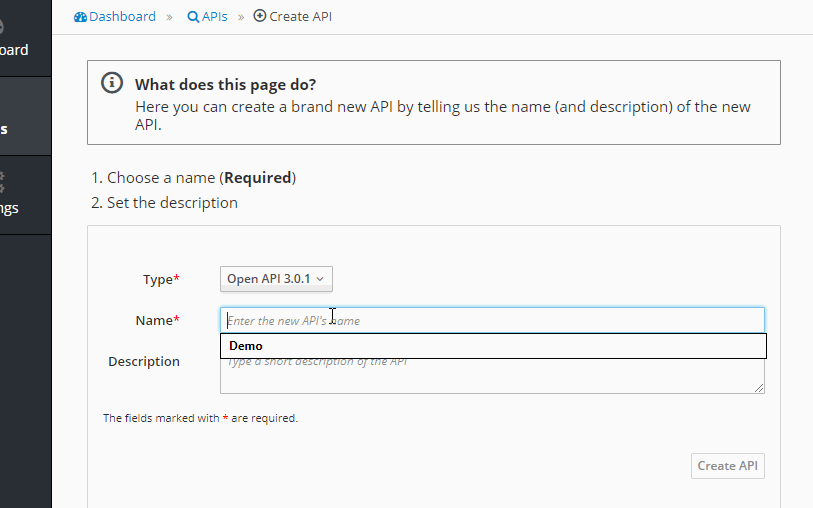
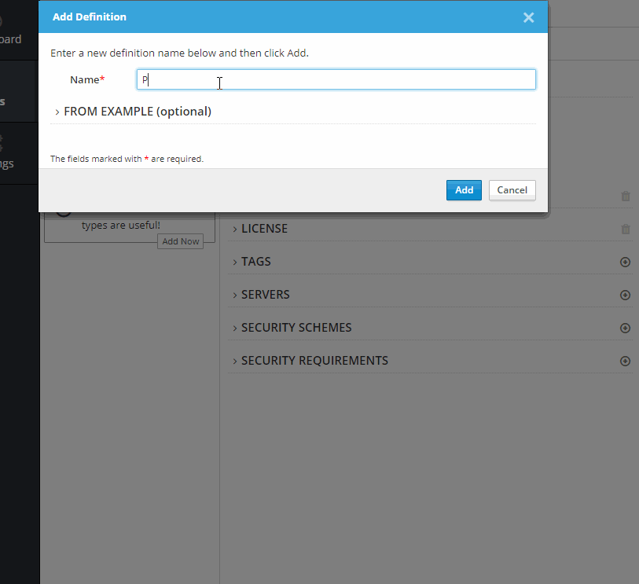
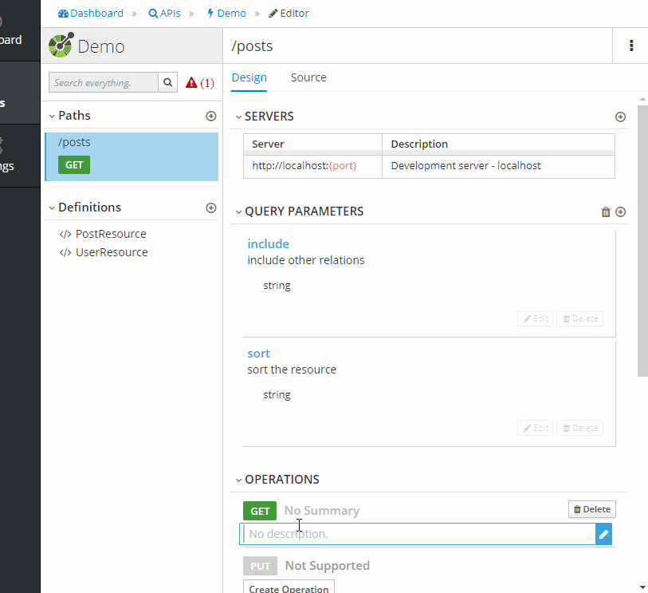
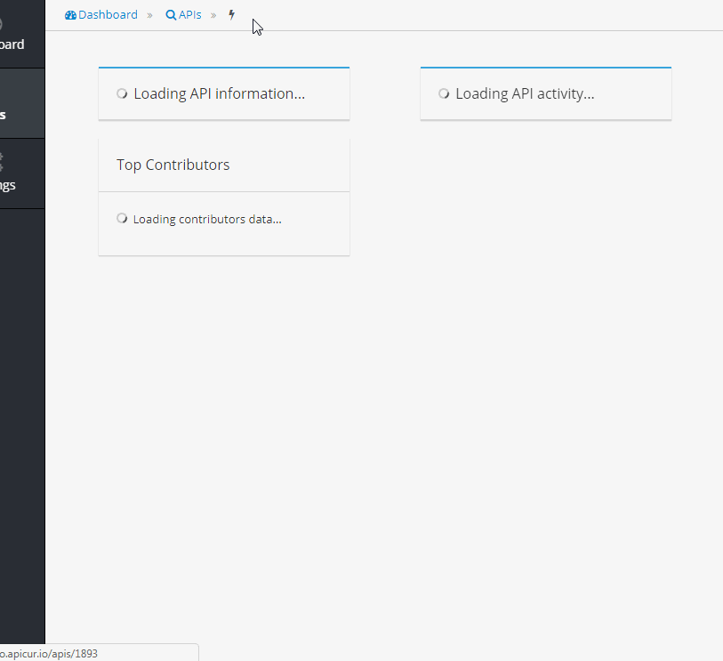

# API documentation seems to be intricate. Not anymore!

The reason that made me write this article is described [here](https://medium.com/@giuvara.alex/api-documentation-seems-to-be-intricate-not-anymore-657f83897acc)

Live demo: https://alexgiuvara.github.io

The functional tests are very handy, as they describe:
- the request
- the response
- all possible status codes (2xx,4xx)

This demo has a [single test](https://github.com/alexgiuvara/doc/blob/20b3820055f8874b7d178cc924cbed1992076329/tests/Feature/Controllers/PostIndexTest.php), due to lack of spare time.

### To generate the documentation, please visit [Apicur.io](https://www.apicur.io) and click "Try Live" button

# Create the project

# Add the components

# Set-up the route

# Export the file

